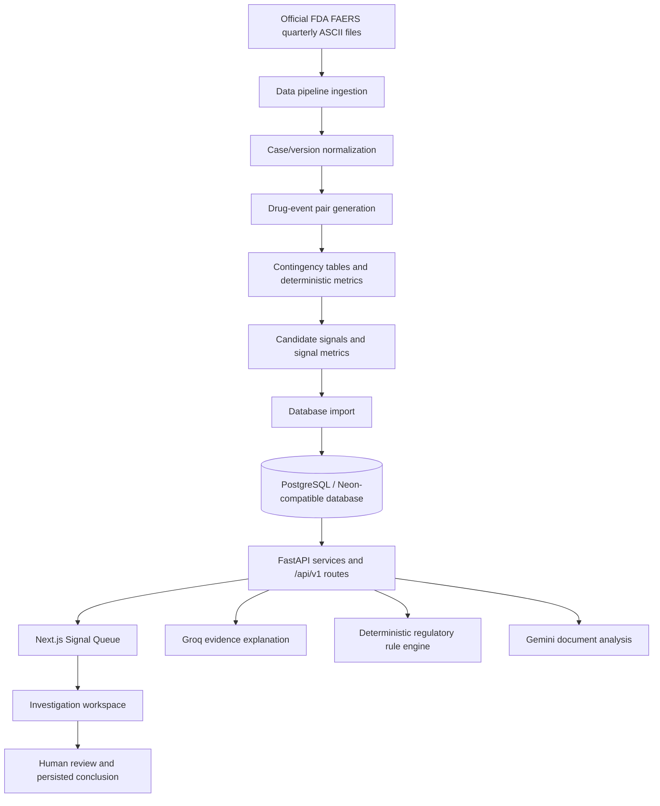

# SignalTrace Architecture

SignalTrace is a FastAPI and Next.js decision-support application backed by deterministic FDA FAERS processing and a PostgreSQL-compatible database. AI services explain or inspect evidence; they do not calculate the core signal metrics or make final decisions.

## End-to-End Data Flow



## Source Data and Dataset Scope

The primary source is official FDA FAERS quarterly data. The current populated application uses **2026Q1** as the imported Neon/PostgreSQL dataset.

The demonstrated reporting-trend use case also uses historical **2025Q4** data extracted from the official FDA archive. This historical input supports the demonstrated trend calculation; it does not mean that a full 2025Q4 report-level dataset has been imported into `processed_reports`.

The pipeline runner is `src/data_pipeline/run_pipeline.py`. It loads the DEMO, DRUG, REAC, and OUTC FAERS tables, handles case/version policy, generates drug-event pairs, computes metrics, detects candidates, and writes deterministic output artifacts plus a provenance manifest.

## Data and ML Layers

### `src/data_pipeline`

- Loads official FAERS ASCII tables.
- Normalizes report and case data.
- Applies case-version and deleted-case handling.
- Generates drug-event pairs.
- Builds contingency-table statistics.
- Detects candidate signals.
- Writes normalized reports, signal metrics, candidate signals, quality reports, and manifests.

### `src/ml`

- Provides trend scoring, risk scoring, ranking, clustering, and enrichment utilities.
- Imports candidate signal and report-level artifacts through the existing backend SQLAlchemy models.
- Does not introduce a second database abstraction.

The shared trend scorer returns a normalized value in `[-1, 1]` when at least two valid quarterly points exist. Otherwise it returns `None`.

## Persistence Layer

The backend models in `src/backend/database/models.py` represent the main persisted entities:

- FAERS quarterly metadata
- Processed report-level data
- Drug-event pairs
- Signals
- Signal metrics
- Case quality reports
- Potential duplicate candidates
- Uploaded documents and document analyses
- AI summaries
- Human reviews

SQLAlchemy provides access to PostgreSQL-compatible deployments. Alembic migrations manage the production schema. SQLite is used by the automated test fixtures and supported development paths where configured.

## FastAPI Backend

`src/backend/app/main.py` creates the FastAPI application, configures CORS from settings, registers error handlers, and includes the versioned router.

The API responsibilities are divided into:

- `api/v1/signals.py`: candidate signals, signal details, metrics, reports, evidence, case quality, duplicates, explanations, and regulatory impact.
- `api/v1/documents.py`: document upload, extraction metadata, Gemini analysis, and stored analysis retrieval.
- `api/v1/reviews.py`: human review retrieval and persistence.
- `api/v1/openfda.py`: optional external drug/event lookups.
- `api/v1/datasets.py`: dataset release metadata.
- `services/`: database-backed application logic.
- `rules/`: deterministic Potential Review Area evaluation.
- `ai/`: Groq and Gemini API clients.

The primary signal facts and statistical calculations remain backend-owned. The frontend does not recompute PRR, ROR, chi-square, or trend values.

## Frontend

`src/frontend` is a Next.js App Router application with React and TypeScript.

The main flow is:

```text
app/page.tsx
    |
    +-- Dashboard
    |     +-- SignalListTable
    |     +-- LiveSearchWidget
    |
    +-- SignalDetail
          +-- Overview / InvestigationSummary
          +-- Evidence / EvidenceExplorer
          +-- Quality / SignalMetricsDetail
          +-- Regulatory / RegulatoryPanel
          +-- Documents / DocumentWorkflow
          +-- AI explanation / AiExplanationPanel
          +-- Human Review / HumanReviewPanel
```

The typed `ApiClient` interface has a `RealAdapter` for FastAPI and a `MockAdapter` for isolated development routes. `NEXT_PUBLIC_USE_MOCKS=false` selects the real adapter; otherwise the frontend defaults to mocks.

The investigation workspace keeps its tab components mounted and toggles visibility. This preserves Evidence Explorer selection, document/AI state, Human Review form state, and loaded component state when users switch sections.

## Evidence and Investigation Flow

1. The queue obtains candidate signals from `GET /api/v1/signals`.
2. The selected signal provides identity and high-level status context.
3. Overview combines the investigation summary with deterministic signal facts.
4. Evidence Explorer retrieves supporting processed reports and opens report detail in a drawer/sheet.
5. Quality retrieves completeness indicators; Duplicate Triage retrieves potential candidates for human triage.
6. Regulatory Review evaluates deterministic rules and returns Potential Review Areas and rule matches.
7. Documents are uploaded, text-extracted, analyzed by Gemini, and persisted with a human-review requirement.
8. Groq receives a structured evidence fact map and returns an advisory explanation.
9. Human Review stores status, checklist, reviewer notes, and a human-authored conclusion.

## AI Boundaries

### Groq

The explanation service calls `get_signal_evidence()`, builds an explicit backend fact map, and sends that fact map to Groq. The model can explain why a candidate was flagged, summarize evidence, describe limitations, and suggest questions. It does not produce the PRR, ROR, chi-square, report count, or final decision.

### Gemini

The document service extracts text from PDF, DOCX, or TXT uploads and sends document content plus signal context to Gemini. The returned sections and coverage-gap statements are advisory and persisted with a human-review requirement.

## Regulatory Boundaries

The rule engine evaluates signal facts against deterministic rules and returns Potential Review Areas and explainable rule matches. It does not confirm a deficiency, decide a submission, modify a document, or submit anything to a regulator.

## Human Review Boundary

The reviewer controls status, checklist completion, notes, and conclusion. The system requires professional review for candidate signals, AI explanations, potential duplicate candidates, regulatory mappings, and document coverage gaps.
